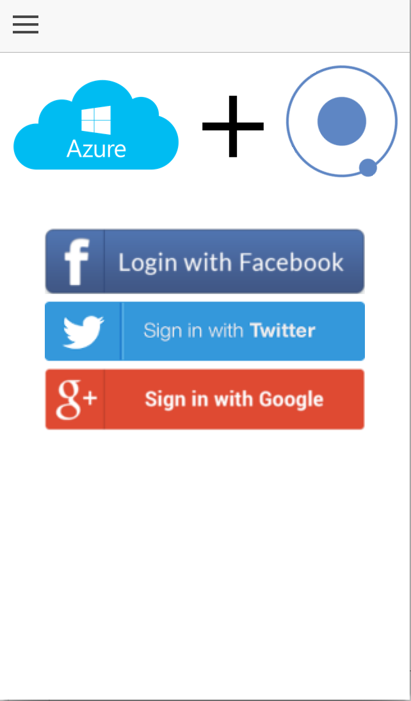
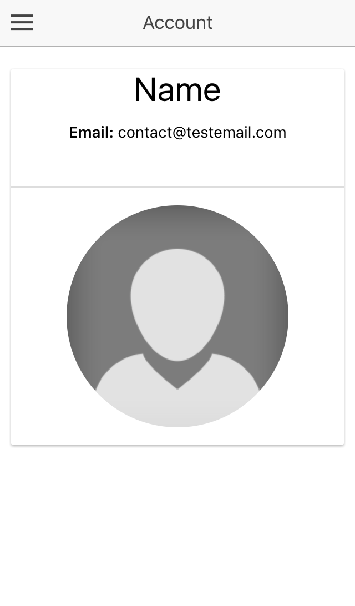
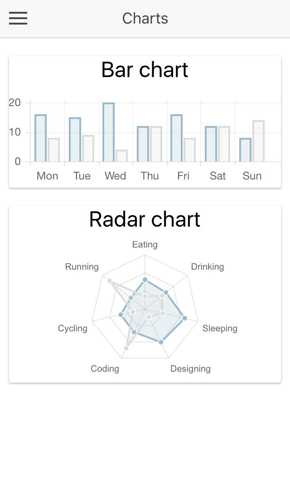
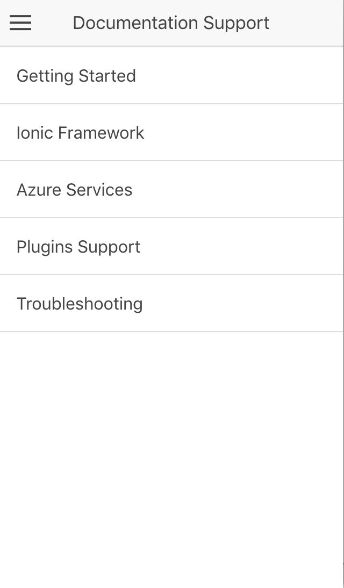

# Azure Mobile App Services with Ionic Template

An application using Apache Cordova, Ionic Framework, and Azure mobile app services. Currently supporting iOS, Android and Windows 10.

## Important!
To learn more about Tools for Apache Cordova, visit this [link](https://taco.visualstudio.com/).

## Table of Contents
 - [Requirements](#requirements)
 - [Configuring Azure services](#configuring-azure-services)
 - [Getting Started](#getting-started)
 - [App Preview](#app-preview)
 - [File Structure of App](#file-structure-of-app)

## Requirements
1. node.js
2. Cordova and Ionic - npm install cordova ionic
3. Gulp - npm install gulp
4. Bower - npm install bower

## Configuring Azure services
The app uses these 3 azure services, enable them by following these steps:

1. [Data Access](https://azure.microsoft.com/en-us/documentation/articles/app-service-mobile-cordova-get-started/)
2. [Authentication](https://azure.microsoft.com/en-us/documentation/articles/app-service-mobile-cordova-get-started-users/) 
3. [Push Notification](https://azure.microsoft.com/en-us/documentation/articles/app-service-mobile-cordova-get-started-push/)

## Getting Started

With VS Code:
* Clone this repository.
* Run `npm install` from the project root.
* Run `bower install` from the project root.
* Run `ionic state reset` to install plugins and platforms from package.json.
* Build the project by running gulp tsc and then `ionic build <platform name>`
* Deploy to device or emulator by running `ionic run <platform name>` or `ionic emulate <platform name>`
* Success

** Note: To improve your Cordova development workflow, install [VS Code Cordova extension](https://marketplace.visualstudio.com/items?itemName=vsmobile.cordova-tools). 
* Launch the VS Code Command Palette – (Ctrl+Shift+P on Windows, Cmd+Shift+P on Mac) – and type the following command and hit Enter: 
> ext install cordova-tools

With Visual Studio:
* Clone this repository.
* Open the azure-services-with-ionic.sln in Visual Studio.
* Open Task Runner window by pressing Ctrl+Alt+Bkspce. 
* Install npm packages by going to your Solution Explorer -> Dependencies -> npm and clicking on 'Restore Packages'. 
* Once packages are restored, build the project and deploy it on Ripple or an android emulator.
* Success

## App Preview

### iPhone 5

<!-- images of iOS app -->






## File Structure of App

```
azure-services-with-ionic/
│
├── node_modules/                      * Node dependencies
|
├── platforms/                         * Cordova generated native platform code
|
├── plugins/                           * Cordova native plugins go
|
├── resources/                         * Images for splash screens and icons
|
├── typings/                           * Contains all typings for this project
|
├── www/                               * Folder that is copied over to platforms www directory
│   │   
│   ├── js/                            * Contains transpiled JS files from TS files            
│   │
│   ├── css/                           * Compiled CSS
│   │
│   ├── img/                           * App images
│   │
│   ├── lib/                           * Dependencies from bower install 
│   │
│   └── index.html                     * Main entry point
|
├── .editorconfig                      * Defines coding styles between editors
├── .gitignore                         * Example git ignore file
├── config.xml                         * Cordova configuration file
├── gulpfile.js                        * Contains gulp tasks for compiling ts files, scss files and more..
├── ionic.project                      * Ionic configuration file
├── package.json                       * Our javascript dependencies
├── azure-services-with-ionic.sln         * VS solution
├── azure-services-with-ionic.jsproj        
├── azure-services-with-ionic.jsproj.user     
└── README.md                          * This file
```
